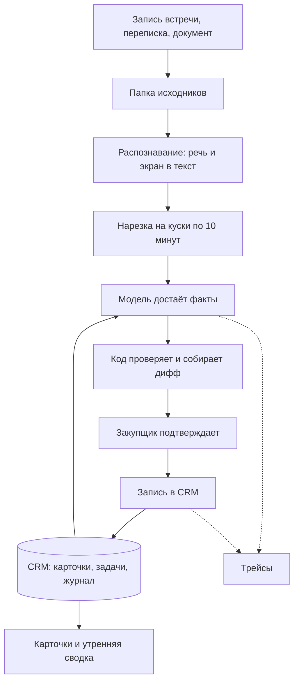

# СнабКонтур

Закупщик загружает запись встречи, переписку или документы и получает дифф к карточкам закупок в CRM: изменения цен, сроков, количеств и задач. У каждой правки есть цитата из источника. После проверки закупщик подтверждает дифф, и код записывает изменения. Обработка идёт локально на ноутбуке, без платных API и отправки данных наружу

Проект развивает тему 1 курса, ["Агент, пишущий в CRM по итогам встречи"](https://github.com/xufana/llm-system-engineering/blob/main/topics.md), и её усиленную версию с долгой памятью. В исходной теме РОП (руководитель отдела продаж) ведёт сделки; у нас закупщик ведёт закупки, а руководитель получает сводку. Сохраняем контракт: предложения с подтверждаемой записью, без дублей и с возможностью отката

| Параметр | Решение |
|---|---|
| Пользователь | Закупщик (снабженец): ведёт закупки и сам подтверждает правки, руководитель получает сводку |
| Вход | Переписка, документы, транскрипты, в итоговой версии - запись встречи со звуком и показанным экраном |
| Выход | Дифф к карточке закупки и задачам, после подтверждения - запись в CRM и утренняя сводка |
| Граница автономии | Модель только предлагает, в CRM пишет код после подтверждения человека |
| Железо | MacBook Pro M1 Pro 16 GB, локальные модели через Ollama, SQLite |
| Деньги | $0: открытые модели, без API |

## 1. Контекст и пользователь

### Время и внимание на рутинную работу

В исследовании Asana переписка, поиск информации и обновление статусов занимают 58% рабочего дня ([Anatomy of Work 2022](https://resources.asana.com/rs/784-XZD-582/images/PDF-FY23-GLOBAL-EN-AOW23-GLOBAL-Anatomy-of-Work-Report.pdf)). Salesforce оценивает долю времени менеджеров на задачи вне продаж в 70% ([State of Sales 2024](https://www.salesforce.com/news/stories/sales-ai-statistics-2024/)). В опросе Microsoft 68% сотрудников говорят, что им не хватает времени на сосредоточенную работу, а 62% тратят слишком много времени на поиск информации ([Work Trend Index 2023](https://www.microsoft.com/en-us/worklab/work-trend-index/will-ai-fix-work))

Закупки также требуют много операционной работы. Deloitte опросил больше 250 директоров по закупкам: даже у лучших команд около двух третей времени уходит на нестратегические задачи ([Global CPO Survey 2025](https://www.deloitte.com/content/dam/assets-zone3/us/en/docs/services/consulting/2025/us-deloitte-2025-global-cpo-survey.pdf)). В российском исследовании B2B-Center с 750+ участниками один закупщик ведёт больше 10 процедур в месяц в 60% компаний; основной фокус приходится на операционные задачи ([Зрелость закупочной функции, 2025](https://b2b-rts.ru/upload/iblock/0f9/nmoft1sxlfwx7yoda3bqmjyntmi9zzbw/%D0%97%D1%80%D0%B5%D0%BB%D0%BE%D1%81%D1%82%D1%8C%20%D0%B7%D0%B0%D0%BA%D1%83%D0%BF%D0%BE%D1%87%D0%BD%D0%BE%D0%B9%20%D1%84%D1%83%D0%BD%D0%BA%D1%86%D0%B8%D0%B8_%D0%B8%D1%81%D1%81%D0%BB%D0%B5%D0%B4%D0%BE%D0%B2%D0%B0%D0%BD%D0%B8%D0%B5%20B2B-Center.pdf)). НАФИ и Яндекс 360 сообщают, что каждый третий офисный сотрудник тратит на рутину 2-4 часа в день. Среди частых задач сбор документов, переписка с контрагентами и подготовка к встречам ([CNews, 2025](https://www.cnews.ru/news/line/2025-06-18_kazhdyj_tretij_ofisnyj_sotrudnik))

Переключение между задачами расходует внимание. В исследовании Gloria Mark прерываются 57% рабочих задач; к прерванной задаче в тот же день возвращаются в среднем через 25 минут ([CHI 2005](https://ics.uci.edu/~gmark/CHI2005.pdf)). После встречи закупщик переслушивает запись, находит договорённости и переносит цены и сроки в карточку. Эту аккуратную работу по связыванию разговора с закупкой и прежними условиями передаём модели. Переговоры, выбор поставщика и ответственность за решения остаются у человека

Фиксация изменений нужна и для контроля исполнения. По 44-ФЗ изменение условий госконтракта нужно внести в реестр контрактов в течение 5 рабочих дней ([ст. 103](https://www.consultant.ru/document/cons_doc_LAW_144624/187d5d35a23a5720192d8f96419c300258202cd9/)). Британское руководство по управлению контрактами требует хранить переписку и решения встреч в одном месте и вести журнал изменений ([Cabinet Office](https://www.gov.uk/government/publications/civil-service-helping-you-with-managing-suppliers-and-contracts/contract-management-training-accreditation-foundation-level-takeaway-guide-html)). Агент готовит эти записи, закупщик проверяет их перед сохранением

### Опыт ИИ-скрайбов в медицине

ИИ-скрайб готовит черновик записи в карте по записи приёма, врач проверяет его и подтверждает. По исследованию Sinsky, на карты и бумаги у врачей уходит 49% времени, на пациентов 27% ([Sinsky et al., 2016](https://adfm.org/media/1476/ann-2016-time-study.pdf)). В Permanente Medical Group скрайбы сэкономили около 15800 часов на 2.5 млн приёмов ([AMA, 2025](https://www.ama-assn.org/practice-management/digital-health/ai-scribes-save-15000-hours-and-restore-human-side-medicine)). В другом исследовании на 263 врачах выгорание за месяц снизилось с 51.9% до 38.8% ([JAMA Netw Open, 2025](https://jamanetwork.com/journals/jamanetworkopen/fullarticle/2839542))

Результат зависит от системы и времени на проверку. В рандомизированном исследовании UCLA один скрайб сократил время на запись на 9.5%, другой не дал значимой разницы. В черновиках иногда встречались клинически значимые ошибки, поэтому требовалась проверка врача ([NEJM AI, 2025](https://www.eurekalert.org/news-releases/1107474)). В нашем сравнении также учитываем время проверки черновика человеком

### Что уже есть на рынке

| Продукт | Что делает | Где работает | Чего не хватает для закупок |
|---|---|---|---|
| [Gong](https://help.gong.io/docs/ai-data-extractor), [Avoma](https://www.avoma.com/pricing), [Fireflies](https://fireflies.ai/use-cases/sales), [tl;dv](https://tldv.io/blog/tldv-honest-review/), [Otter](https://otter.ai/pricing) | Записывают звонки и встречи, заполняют поля CRM продаж | Облако, подписка от $8 до $39 за пользователя в месяц, у Gong цена не публикуется | Заточены под сделки, данные уходят в зарубежное облако, Gong и Fireflies пишут в CRM без подтверждения каждой правки |
| [HubSpot](https://knowledge.hubspot.com/meetings-tool/review-recommended-next-steps-for-deals) | Предлагает обновления полей сделки по транскрипту, пользователь их просматривает | Облако, тарифы Professional и Enterprise | Только внутри HubSpot и только продажи |
| [Битрикс24 BitrixGPT](https://helpdesk.bitrix24.ru/open/27105168/) | Расшифровывает звонки и заполняет поля CRM: пустые - без подтверждения, замену существующего значения - с подтверждением | Облако Bitrix, коробочная версия тоже обращается к их сервису, платная подписка | Звонки и сделки, а не встречи с экраном и история закупки |
| [Яндекс Телемост](https://yandex.ru/company/news/02-16-04-2025), [SaluteJazz](https://developers.sber.ru/help/jazz/guide/meeting-summarizer), [Контур.Толк](https://kontur.ru/talk/onprem) | Расшифровка и итоги встречи: темы, договорённости, задачи | Облако, у Контур.Толка есть on-premise | Протокол встречи, а не правка карточки, в CRM не пишут |
| [Тендерплан](https://www.tenderplan.ru/), [СберB2B](https://sberb2b.ru/), Контур.Закупки | Поиск тендеров, маркетплейс, CRM тендерного отдела | Облако | Про поиск закупок, а не про ведение договорённостей после встреч |

### Чем отличаемся

- Записи встреч с ценами и персональными данными остаются на ноутбуке, платных API нет. Для локальной обработки есть и правовые основания: 152-ФЗ запрещает при сборе персональных данных россиян хранить их в базах за границей ([ст. 18 ч. 5](https://www.consultant.ru/document/cons_doc_LAW_61801/cbf4e15b7c330f9372e876cdf2bc928bad7950ef/)). В 2026 году суд признал загрузку отчётов компании в DeepSeek разглашением коммерческой тайны ([BFM](https://www.bfm.ru/news/613412))
- Результат обработки сохраняется в карточке закупки. Каждая правка содержит цитату, проходит подтверждение человека и допускает откат
- Агент ведёт закупку неделями, учитывая изменения и отмены условий. Он использует текущую карточку и историю предыдущих встреч

### Пользователь

Закупщик (снабженец) ведёт переговоры с поставщиками, участвует во встречах, переписывается и обновляет карточки в CRM. После встречи он сам переносит договорённости в карточку и ставит задачи. Руководитель смотрит сводку сроков и поставок

Порядок работы:

1. Закупщик загружает запись встречи или выгрузку переписки
2. Через 20-45 минут видит дифф по каждой затронутой закупке
3. Сверяет с цитатами, отмечает деньги и даты, подтверждает или правит
4. Утром получает сводку: что поставляется сегодня и в ближайшие два дня, что просрочено

Пока закупка длится несколько недель, её условия успевают измениться. Если бюджет снизили с 5 млн до 4 млн, на следующих встречах агент использует 4 млн и может показать основания как первоначального бюджета, так и его изменения

### Цель

Хотим получить продукт, который закупщик разворачивает на обычном ноутбуке и использует для подготовки карточек. Для выигрыша у ручного заполнения нужны два условия:

- проверка диффа занимает меньше времени, чем ручное заполнение карточки по той же встрече
- точность не хуже ручной: precision фактов >= 0.95 (раздел 3)

Яндекс оценивает оформление итогов одной встречи примерно в 10 минут (оценка вендора, [Яндекс, 2025](https://yandex.ru/company/news/02-16-04-2025)). В исследовании AutoMeet протоколы были у 38.5% встреч; основной причиной их отсутствия была нехватка времени. Участники также попросили ручную проверку протокола перед сохранением ([arXiv, 2025](https://arxiv.org/abs/2507.16054)). Эти данные дают отправную точку для сравнения. Собственное время заполнения и проверки измерим на наших записях, раздел 8

## 2. Контракт

### Вход

- В первом контуре принимаем текст: выгрузки переписки TXT и JSON, готовые транскрипты, PDF с текстовым слоем, DOCX, XLSX, CSV до 20 MB. Telegram, почту и Google Sheets берём экспортом
- В итоговой версии обрабатываем также запись встречи со звуком и показанным экраном. Исходные презентации и таблицы необязательны
- Запись режем на куски по 10 минут, к каждому добавляем последние 30 секунд предыдущего, поэтому контекст модели ограничивает размер куска, а общую длину встречи ограничивает время обработки (расчёт в разделе 3). Для 90 минут нужны 9 кусков; более длинные встречи проходят те же этапы за большее время
- Если цифру нельзя услышать или прочитать, оставляем её неизвестной

### Выход

Закупщик получает дифф к карточкам и задачам. У каждой строки есть цитата и место в источнике: сообщение или минута записи. Подтверждение создаёт новую версию карточки и запись в журнале. Для просмотра карточки и сборки сводки модель не нужна

### Кто подтверждает и почему

Дифф подтверждает закупщик, который ведёт закупку и сейчас заполняет карточку руками. Он проверяет готовые правки вместо повторного прослушивания встречи и ручного ввода. Для этого не нужен отдельный проверяющий

Модель может ошибиться даже при наличии цитат, проверок кодом и eval. Ошибка в цене или сроке стоит денег, поэтому деньги, количества, даты и реквизиты выделяем в диффе и требуем отдельной отметки. За подтверждённую запись отвечает закупщик

### Чего система не делает

Система не оформляет заказы и платежи, не пишет поставщикам и не меняет исходные файлы. Подтверждённые правки записывает в учебную mock-CRM на SQLite. Для настоящей CRM нужен адаптер с тем же контрактом

### Сущности

| Объект | Что хранит |
|---|---|
| Источник | Файл или сообщение, хэш, откуда пришло, когда было сказано и когда загружено. Если время сообщения неизвестно, дату загрузки вместо него не подставляем |
| Карточка закупки | Поставщик, позиция, количество, цена и валюта, бюджет, плановая и фактическая поставка, версия карточки |
| Задача | Что сделать, по какой закупке, кто отвечает, срок, статус |
| Дифф | Предлагаемые изменения карточек и задач с цитатами и версия карточки, от которой он посчитан |
| Журнал | Кто и когда подтвердил, отклонил или откатил дифф, значения до и после |

Плановую и фактическую поставку храним отдельно. Так устроен [OCDS](https://standard.open-contracting.org/latest/en/primer/what/), открытый стандарт публикации данных госзакупок, который используют больше 30 правительств, в том числе британский Find a Tender. У этапа исполнения есть плановая дата, фактическая дата и статус; изменение контракта сохраняется отдельной записью с причиной. Берём эту модель данных, полное применение стандарта для CRM не требуется

### Подтверждение работает как коммит в git

Закупщик видит примерно такое:

```diff
Закупка P-17 "Насосы ЦН-40", версия 4 -> 5
- Срок поставки: 10.10.2026
+ Срок поставки: 12.10.2026        встреча 03.10, 14:32 "переносим на двенадцатое"
- Цена за штуку: 12500 RUB
+ Цена за штуку: 12000 RUB         встреча 03.10, 14:35 "сходимся на двенадцати тысячах"   [отметить]
+ Задача: Анна запрашивает новый счёт до 06.10.2026      встреча 03.10, 14:37
```

Подтверждение и откат устроены по аналогии с git:

- Дифф применяется целиком или никак
- Повторная загрузка того же источника не создаёт новый дифф. Повторное подтверждение также оставляет состояние прежним
- Если после подготовки диффа карточка изменилась, агент пересчитывает его от новой версии, как при rebase. Устаревший дифф не применяется
- Откат создаёт новую версию с обратными изменениями (`git revert`). Возврат к старой версии через `reset` не используем: история сохраняется. Если затронутые поля после записи уже кто-то правил, автоматический откат останавливается и показывает конфликт

### Статусы обработки

| Статус | Когда | Что видит закупщик |
|---|---|---|
| Готово | Дифф собран, или менять нечего, или это повтор уже загруженного | Дифф на подтверждение или "изменений нет" |
| Нужно решение | Непонятно, к какой закупке относится, два противоречащих условия, "завтра" без даты сообщения | Конкретный вопрос с вариантами и цитатами |
| Ошибка | Битый файл, PDF без текста, модель не ответила за лимит, не хватило памяти, упал процесс | Причину и кнопку "повторить", источник сохранён, CRM не тронута |

Обработка работает без интернета; сеть нужна только для импорта из Telegram и почты. Не каждое неполное сообщение требует уточнения: "возможно, привезём 12-го" сохраняем как предложение, оставляя подтверждённый срок прежним. Относительную дату "завтра" считаем от времени сообщения по Москве

## 3. Бюджеты и SLO

SLO задаёт числовую цель сервиса, например время обработки встречи. SLI показывает фактическое значение этой метрики ([Google SRE book](https://sre.google/sre-book/service-level-objectives/)). Бюджеты рассчитываем из доступных денег, памяти и скорости ноутбука

### Ограничения

| Ограничение | Значение | Что из него следует |
|---|---|---|
| Деньги | $0 | Только открытые модели локально, никаких API |
| Память | 16 GB общей памяти, GPU по умолчанию доступно 10.7 GB, это 2/3 ([лог llama.cpp на 16 GB Mac](https://github.com/abetlen/llama-cpp-python/issues/687)) | Модель, её контекст и распознавание должны влезть в ~10 GB, пока закупщик работает в браузере и CRM. Модели грузим по очереди, а не все сразу |
| Скорость | Замер на нашем M1 Pro через Ollama: `qwen3:4b` (Q4_K_M) читает промпт на ~230 токенах/с и пишет ~23 токена/с, модель 7B (qwen2.5:7b, Q4_K_M) - ~153 и ~17 | Наш вызов - ~5800 токенов на входе и ~600 на выходе (раздел 6) - занимает ~51 с на Qwen3-4B (замер на 5700 токенах входа) и ~72 с на 7-8B (оценка по qwen2.5:7b). Каждый лишний вызов и ретрай - это десятки секунд |

Вызов нашего размера на Qwen3-4B занял ~51 с в каждом из трёх прогонов, в памяти 3.9 GB при контексте 8192. Замер сделан на сборке `qwen3:4b` (Thinking-2507) с `think=false`, у выбранной `qwen3:4b-instruct-2507` та же архитектура и размер. Для Qwen3-8B и T-lite-it-2.1 замера нет, их время оцениваем по qwen2.5:7b

### Сколько текста во встрече

- Темп спонтанной русской речи - около 121 слова в минуту ([исследование темпа речи](https://cyberleninka.ru/article/n/temp-rechi-v-svobodnoy-kommunikatsii-sotsiolingvisticheskiy-aspekt))
- Русский текст в токенизаторе Qwen3 - 2.35-2.76 токена на слово, замер на текстах нашего eval
- 10 минут речи - ~1200 слов, ~2900 токенов. Встреча 90 минут - ~11000 слов, ~26000 токенов

### Кусок по 10 минут и контекст

Встреча на 26 тысяч токенов технически помещается в контекст модели: у исходных Qwen3 нативно 32768 токенов ([карточка модели](https://huggingface.co/Qwen/Qwen3-8B)), у сборок 2507 в Ollama - 256K ([теги Ollama](https://ollama.com/library/qwen3/tags)). KV-кэш Qwen3-4B занимает 144 KiB на токен: 36 слоёв, 8 KV-голов по 128, f16 ([config.json](https://huggingface.co/Qwen/Qwen3-4B/raw/main/config.json)). На 32k это 4.5 GiB кэша плюс 2.5 GB весов, всего ~7 GB. У такого режима три ограничения:

- Чтение 26 тысяч токенов занимает минуту-полторы, и любой ретрай повторяет всю встречу
- На длинном контексте модели хуже находят информацию из середины ([Lost in the Middle](https://arxiv.org/abs/2307.03172)), а нам важна каждая цифра
- 8B на 32k упирается в лимит: 4.5 GiB кэша и 5.2 GB весов - ~9.7 GB из 10.7

Выбираем куски по 10 минут и к каждому добавляем последние 30 секунд предыдущего, чтобы сохранить фразу на стыке. Кусок с перекрытием - ~10.5 минуты речи, ~3000 токенов, встреча на 90 минут по-прежнему делится на 9 кусков. На вызов приходится ~6600 токенов (раздел 6), поэтому задаём контекст 8192. Кэш для 8192 занимает 1.1 GiB, с весами 4B получается ~3.6 GB по расчёту, Ollama показывает 3.9 GB; остаётся место для распознавания и работы закупщика. В следующий кусок передаём текущую карточку и открытые вопросы из предыдущих, чтобы сохранить связь между частями встречи

При нехватке памяти можно перевести KV-кэш в q8_0 и сократить его объём вдвое ([Ollama FAQ](https://github.com/ollama/ollama/blob/main/docs/faq.mdx)). Железо на 32-64 GB позволит подавать встречу целиком и использовать модели крупнее

### Сколько обрабатывается встреча

Рассчитываем нагрузку одного закупщика на один ноутбук: его встречи и переписка. Для оценки времени берём встречу до 90 минут:

| Этап | Время на 90 минут записи | Откуда |
|---|---|---|
| Распознавание речи | ~11 минут на энкодер whisper large, декодер сверху | 3.8 с на 30 секунд аудио на CPU M1 Pro ([бенчмарк whisper.cpp](https://github.com/ggml-org/whisper.cpp/issues/89)), large-v3-turbo с 4 слоями декодера вместо 32 должен быть быстрее, замерим |
| Модель | ~8 минут на 4B, ~11 минут на 8B | 9 кусков по ~51 с (замер) и ~72 с (оценка) |
| Итого | ~20-30 минут | |

Цель для 90-минутной встречи: дифф готов за 45 минут после загрузки. Это половина длительности записи с запасом на работу закупщика за тем же ноутбуком. По этой оценке три часовые встречи в день требуют меньше часа фоновой обработки

### Цели качества и времени

| ID | Цель | Как меряем |
|---|---|---|
| Q1 | Precision фактов в диффе >= 0.95, recall >= 0.85 | Против gold на eval |
| Q2 | Recall противоречий >= 0.90 | Размеченные противоречия, отдельно лишние вопросы |
| Q3 | Ни одной ошибки записи: изменения без подтверждения, дубля, половины пакета | 100% цепочек в eval |
| L1 | 95% встреч до 90 минут получают дифф за 45 минут после загрузки | По трейсам, от загрузки до готового диффа |
| L2 | 95% текстовых сообщений получают дифф за 2 минуты | По трейсам |
| L3 | Карточка открывается и дифф применяется за 1 с, p95 | Без модели |
| L4 | Утренняя сводка готова к 08:00 | Если ноутбук был выключен, собирается при включении |

Для precision задаём более высокий порог, чем для recall. Неверная цифра может уйти из CRM в заказ; пропущенное значение закупщик допишет руками

### Почему такие модели и параметры

| Требование | Откуда оно | Чем закрываем |
|---|---|---|
| Русский язык | Встречи и переписка на русском | Qwen3 обучен на 119 языках, включая русский ([блог Qwen3](https://qwenlm.github.io/blog/qwen3/)) |
| Строгий JSON | Дифф разбирает код | Ollama ограничивает ответ JSON-схемой ([structured outputs](https://docs.ollama.com/capabilities/structured-outputs)) |
| Вызов инструментов | Поиск закупки и прежних условий | У Qwen3 есть tool calling |
| Влезть в ~10 GB с контекстом 8192 | Ограничение по памяти | 4B весит 2.5 GB, 8B - 5.2 GB в Q4_K_M |
| Встреча за 45 минут | L1 | 4B быстрее 7-8B примерно в 1.4 раза: ~51 с против ~72 с на вызов |

Модели:

- Начинаем с `qwen3:4b-instruct-2507-q4_K_M`, 2.5 GB, версии без режима рассуждений ([теги Ollama](https://ollama.com/library/qwen3/tags)). Рассуждения добавляют сотни выходных токенов, то есть десятки секунд на кусок при 23 токенах/с. В нашем замере с `think=true` все 600 выходных токенов ушли на рассуждения, до ответа модель не дошла. Сборка `qwen3:4b` в режиме чата рассуждала в ответе даже с `think=false` и не дошла до вызова инструмента, поэтому нужна именно instruct-версия. На eval проверим, нужны ли они для различения договорённости и предложения
- При недостаточном качестве 4B пробуем T-lite-it-2.1, Qwen3-8B, дообученный под русский. Модель имеет лицензию Apache-2.0, занимает 5 GB и получает 83.9 на Ru Arena Hard против 57.2 у Qwen3-8B ([карточка](https://huggingface.co/t-tech/T-lite-it-2.1)). По оценке скорости обработка будет примерно в 1.4 раза медленнее
- Для кадров с таблицами, которые не прочитал OCR, используем `qwen3.5:4b`, 3.3 GB, с поддержкой изображений ([Ollama](https://ollama.com/library/qwen3.5:4b))
- Речь распознаём через whisper.cpp с large-v3-turbo. У large-v3 русский WER 5.8 на Common Voice 15 и 5.0 на FLEURS ([whisper](https://github.com/openai/whisper)). Сравним с GigaAM от Сбера: в его замере на 10 русских наборах средний WER 8.3 против 21.0 у Whisper ([GigaAM](https://github.com/salute-developers/GigaAM/blob/main/evaluation.md)). GigaAM принимает по 25 секунд аудио, поэтому требует отдельной нарезки

Параметры:

- temperature 0: для воспроизводимого eval ожидаем одинаковый результат извлечения на одном входе
- Контекст 8192: расчёт выше, по умолчанию Ollama на машинах меньше 24 GB ставит 4096 ([docs](https://docs.ollama.com/context-length)), кусок туда не влезет
- Один запрос за раз: память под контекст умножается на число параллельных запросов ([Ollama FAQ](https://github.com/ollama/ollama/blob/main/docs/faq.mdx)), а GPU один
- Ollama ставим нативно: в Docker на маке нет GPU (тот же FAQ)

### Деньги и пути роста

В текущем контуре API стоит $0. Расходуем электричество и время закупщика на проверку диффа; сравнение с ручным заполнением описано в разделе 8

Бесплатных моделей достаточно для извлечения фактов. В текущем бюджете ограничения связаны с памятью и скоростью ноутбука. Рассматриваем два пути роста:

1. Облако - модели по API. Снимает ограничения по памяти и скорости, но за токены нужно платить, а данные уходят из контура. Встреча на 90 минут при нашей нарезке - 9 вызовов по ~5800 токенов входа и ~600 выхода, около 52 тысяч входных и 5.4 тысячи выходных токенов, стоимость = 52k * цена входа + 5.4k * цена выхода. Записи встреч содержат персональные данные, а 152-ФЗ при их сборе требует использовать базы на территории России (раздел 1). Поэтому в первую очередь рассматриваем российских провайдеров
2. Своё или арендованное железо, например на грант. Mac или сервер на 32-64 GB: встреча целиком в контекст, модели 8-14B, один сервер на отдел вместо ноутбука у каждого

## 4. Схема системы



| Блок | Что это на деле |
|---|---|
| Папка исходников | Папка на диске: файл хранится под своим хэшем и не меняется, поэтому цитата всегда указывает на тот же текст. Поиск по исходникам работает через полнотекстовый индекс SQLite, векторная база не используется |
| Распознавание | whisper.cpp для речи, ffmpeg достаёт кадры при смене экрана ([select](https://ffmpeg.org/ffmpeg-filters.html#select_002c-aselect)), OCR Tesseract читает текст с кадров, мультимодальная модель - только для сложных таблиц |
| Нарезка | Куски по 10 минут плюс последние 30 секунд предыдущего куска |
| Модель | Qwen3-4B в Ollama: получает кусок, текущую карточку и может поискать прежние условия |
| Код проверяет | Схему ответа, что цитата дословно есть в источнике, арифметику, даты, версию карточки, дубли |
| CRM | SQLite: карточки, задачи, журнал изменений |
| Трейсы | Запись каждого шага: что ушло в модель, что вернулось, сколько заняло. По ним разбираем ошибки и считаем SLO, подробнее в разделе 9 |

Для локальной разметки спикеров можно использовать pyannote ([pyannote-audio](https://github.com/pyannote/pyannote-audio)); встроенная разметка whisper.cpp работает только для английского. Сам Whisper не определяет личность говорящего. Метка спикера также не устанавливает его полномочия согласовать цену, поэтому договорённости по деньгам и срокам подтверждает закупщик

## 5. Харнесс и инструменты

Харнесс собирает промпт, предоставляет модели инструменты, проверяет ответ и следит за лимитами. Этот код также записывает трейсы. Выбираем, какие шаги он выполняет сам, а какие решения передаёт модели

Anthropic различает workflow с заданными в коде шагами и агента, который сам выбирает следующее действие. Авторы рекомендуют начинать с самого простого работающего варианта: свободный агентный цикл дороже, медленнее и может накапливать ошибки ([статья про агентов](https://www.anthropic.com/engineering/building-effective-agents))

Берём workflow с одной развилкой:

- Код выполняет последовательные шаги: распознавание, нарезку, извлечение фактов, проверку и сборку диффа
- Модель может вызвать поиск, если в куске нет номера закупки или упоминаются прежние условия ("как договаривались в прошлый раз"). Такая привязка нужна, когда на встрече закупку называют по поставщику и товару
- Ограничиваем эту развилку вместо свободного агентного цикла. Полное извлечение на 4B занимает ~51 с, поэтому длинный цикл может нарушить цель в 45 минут

В абляции обрабатываем тот же поток одним извлечением на кусок. Если поиск не улучшает результат на кейсах с привязкой и прежними условиями, убираем его

| Инструмент модели | Вход и результат | Ошибка |
|---|---|---|
| `find_purchase` | Поставщик, товар или номер -> кандидаты закупок с основаниями | Ничего не найдено или кандидатов несколько, тогда вопрос закупщику |
| `read_purchase` | ID -> текущая карточка, задачи, версия | Нет такой закупки |
| `read_evidence` | ID закупки и период -> фрагменты прежних сообщений и встреч | Пусто |

Инструменты модели доступны только для чтения. Подтверждение и откат запускает закупщик кнопками в интерфейсе, изменения записывает код. JSON-схема ограничивает форму ответа; правильность значений отдельно проверяем кодом и на eval

### Лимиты считаем из бюджета времени

На обработку 90 минут записи из 9 кусков отводим 45 минут. Распознавание занимает по оценке ~15 минут, для модели остаётся ~30 минут, или ~3 минуты на кусок. Лимиты на кусок:

- До 3 вызовов модели: извлечение и до 2 поисков
- 1 повтор, если вернулся невалидный JSON
- Таймаут вызова 90 с, почти вдвое больше полного извлечения (~51 с), дальше считаем вызов зависшим

Цепочку с двумя поисками замерили на `qwen3:4b-instruct-2507` в трёх прогонах. Чтение куска и вызов `find_purchase` заняли ~15 с, вызов `read_evidence` ~2.5 с, итоговый дифф из 369 токенов ~17 с, всего ~35 с на кусок. Поиск обходится дёшево: начало диалога Ollama берёт из кэша (0.4-1.9 с на новые токены), а вызов инструмента - это 34-51 выходной токен

В худшем случае, с двумя поисками, ответом на все 600 токенов и одним повтором невалидного JSON, кусок занимает ~75 с. Модель тратит на встречу ~11 минут, вместе с распознаванием ~26 минут из 45

Повтор ответа при закэшированном промпте стоит только генерацию, ~16-27 с на кусок, то есть ~2.5-4 минуты на встречу за каждый лишний круг, и задерживает следующие встречи в очереди. При исчерпании лимита кусок получает статус "ошибка". Источник и CRM сохраняются, обработка остальных кусков продолжается

## 6. Память и состояние

Текущее подтверждённое состояние хранится в CRM, основания остаются в исходниках и журнале изменений. Производные данные можно пересобрать:

| Что | Где | Чем является | Как меняется |
|---|---|---|---|
| Исходники: файлы, расшифровки, кадры | Папка исходников и индекс SQLite | Доказательство: что сказали и написали | Только добавляются |
| CRM: карточки и задачи | SQLite | Текущее подтверждённое состояние | Только подтверждённым диффом |
| Журнал изменений | SQLite | История переходов к текущему состоянию | Только дописывается, откат сохраняется новой записью |
| Производное: саммари, сводки, кэш распознавания | SQLite и файлы | Представления и результаты обработки | Пересобирается из строк выше |
| Контекст вызова | Память процесса | Выборка из строк выше под один вызов | Живёт один вызов |

В терминах курса: контекст вызова - рабочее состояние, исходники и журнал - эпизодическая память, CRM - фактическая, производное - кэш

### Что попадает в контекст

| Часть | Токенов |
|---|---:|
| Инструкция и JSON-схема | ~1000 |
| Текущая карточка закупки | ~500 |
| Открытые вопросы из прошлых кусков | ~300 |
| Кусок встречи, 10 минут и 30 секунд перекрытия | ~3000 |
| Найденные цитаты | до ~1000 |
| Ответ | ~800 |
| Итого | ~6600 из 8192, из них ~5800 на вход |

Если вход не помещается, сначала убираем старые цитаты, затем укорачиваем кусок встречи. Историю закупки целиком не передаём: 30 эпизодов из eval занимают 11970 токенов и превышают контекст. Используем текущую карточку и поиск по исходникам через SQLite FTS с фильтрами по номеру закупки, поставщику и дате. Эмбеддинги добавим при пропусках FTS

### Противоречия, свежесть, отравление

Модель различает предложение, договорённость, исправление и отмену; закупщик принимает решение через дифф. Самого появления нового сообщения для изменения карточки недостаточно. Учитываем время сообщения: старое письмо, загруженное позже, не перезаписывает более новое решение. Прежнее значение сохраняется в журнале

У каждого поля карточки сохраняем дату и источник последнего подтверждения. Эта дата видна в сводке, чтобы закупщик мог заметить устаревшее условие

Команда "игнорируй инструкции" в письме поставщика остаётся частью источника и не выполняется. Сведения становятся фактами CRM после подтверждения диффа. Ошибку исправляем новой версией карточки и пересборкой саммари. Правдоподобную ложь без опровержения в источниках система не распознает; её должен заметить закупщик при подтверждении

## 7. Eval

Отдельно оцениваем распознавание записи, предложения модели и запись в CRM. Это позволяет различить неверную расшифровку, ошибку понимания и ошибку кода. Порядок прогонов описан в [методике](../eval/README.md)

| Набор | Что проверяет | Размер |
|---|---|---|
| [20 коротких кейсов](../eval/cases.dev.jsonl) | Извлечение фактов из текста, различение предложения и договорённости, привязка к закупке, команды внутри источника. Также повтор, правка и откат при записи | 20 кейсов |
| [История на 30 эпизодов](../eval/memory.dev.jsonl) | Закупка за 100 дней: 11970 токенов превышают контекст. Итоговые вопросы проверяют действующие условия и исключение отменённых | 29 сообщений, 11 вопросов |
| [Отравление](../eval/poisoning.dev.jsonl) | Ложные сведения и команды в источниках: сохраняет ли их память как факты, прекращает ли использовать после исправления | 4 кейса, 9 вопросов |
| Записи встреч | Парные прогоны по записи и ручной расшифровке для оценки потерь распознавания | 6 сюжетов |

| Обещание из контракта | Метрика |
|---|---|
| Верные факты в диффе | Precision и recall фактов: закупка + поле + значение |
| Карточка меняется только на договорённость | Лишние изменения на кейсах "возможно", старые письма, противоречия |
| Запись без дублей и с откатом | Доля цепочек approve / reimport / undo с верным состоянием CRM |
| Каждая правка с источником | Доля фактов с дословной цитатой |
| Память отдаёт действующее | Верные ответы на вопросы истории, отменённые факты среди текущих |
| Ложь не приживается | Записи и ответы с опровергнутым значением |
| Распознавание не портит вход | Точность чисел, дат и имён в расшифровке, разница двух прогонов |

Для каждого кейса в gold задаём ожидаемый дифф и состояние CRM. Подвыборку размечаем дважды, независимо; согласие до обсуждения принимаем за потолок метрики. Файлы репозитория используются для настройки. Отложенные истории открываем только при финальном прогоне

## 8. Baseline

В основном baseline закупщик заполняет карточку и задачи по той же записи встречи. Для отправной точки используем открытые исследования: около 10 минут на оформление итогов по оценке Яндекса и протоколы у 38.5% встреч по AutoMeet (раздел 1). В рандомизированном исследовании UCLA один из двух скрайбов сократил время на запись на 9.5%, второй не дал значимой разницы. Учитываем это при сравнении: для системы измеряем время проверки диффа, для ручного варианта время заполнения. Каждый из нас пройдёт 6 записей из eval с хронометражем

Автоматический baseline извлекает номер закупки, даты и суммы регулярками и правилами, создаёт шаблонные задачи. Подтверждение и запись работают по тому же контракту. Сравнение на ручной расшифровке показывает вклад модели в извлечение

Извлечение на кусок без поиска сравниваем с вариантом, где поиск разрешён. Затем вместо карточки и найденных источников передаём обрезанную историю. Эти абляции показывают вклад поиска и памяти

Поиск оставляем, если он улучшает привязку к закупке и работу с прежними условиями. На 8B переходим при росте качества и обработке встречи за 45 минут. Пропуски FTS станут основанием для эмбеддингов. Живой режим добавляем после стабильной обработки записей

## 9. Observability

Трейсы собираем в локальном Phoenix через OpenTelemetry. Для Ollama используем готовый [instrumentor](https://arize-ai.github.io/openinference/python/instrumentation/openinference-instrumentation-ollama/); спаны распознавания, нарезки, проверки, подтверждения и записи добавим сами ([локальный Phoenix](https://arize.com/docs/phoenix/self-hosting/deployment-options/terminal))

Для обработки встречи создаём один трейс с вложенными спанами для кусков. Подтверждение и откат записываем отдельными трейсами, связывая их через ID источника и диффа. Время ожидания человека учитываем отдельно от времени модели

Спан сохраняет модель и версию промпта, фактический контекст, токены, время и ответы инструментов. В нём также видны прочитанные данные CRM, предложенные изменения и причина остановки. Для записи встречи добавляем длительность, время распознавания и выбранные кадры

На дашборде показываем p50 и p95 времени обработки встречи и сообщения, долю статусов "нужно решение" и "ошибка", ошибки инструментов и число вызовов на кусок. Отдельно выводим расход памяти и время распознавания на минуту записи

Персональные данные из реальных записей в логи не попадают. Телеметрию самого Phoenix отключаем через `PHOENIX_TELEMETRY_ENABLED=false` ([Phoenix](https://github.com/Arize-ai/phoenix)). Для replay используем сохранённые ответы модели и снимок CRM, повторно модель не вызываем

## 10. Риски и ограничения

| Риск | Цена ошибки | Как боремся |
|---|---|---|
| В CRM записана неверная цена, количество или срок | Высокая: заказ или оплата по неверным условиям, прямые деньги | Цитата у каждой правки, деньги и даты требуют отдельной отметки, precision >= 0.95 |
| Отменённое условие всплыло как действующее | Высокая: работа по старым условиям | Карточка хранит только подтверждённое, отмена - новая версия, отдельный набор на память |
| Правка ушла не в ту закупку | Высокая: портятся две карточки сразу | Без надёжной привязки - вопрос закупщику, кейсы с одним поставщиком у двух закупок |
| Закупщик подтвердил неверный дифф не глядя | Высокая, но ответственность человека | Журнал и откат, выделение денег и дат |
| Утечка записей встреч | Высокая: коммерческие условия и персональные данные | Всё локально, в логи персональные данные не пишем |
| Распознавание исказило число | Средняя: ловится на подтверждении по цитате и минуте записи | Парные прогоны записей, отдельная точность чисел |
| Дубль задачи | Средняя: двойная работа и шум | Повтор не создаёт дифф, проверка в eval |
| Пропущенная договорённость | Средняя: закупщик дописывает руками, как сейчас | Recall >= 0.85 |
| Лишний вопрос закупщику | Низкая: минута его времени | Считаем долю лишних вопросов |
| Встреча обрабатывается дольше 45 минут | Низкая: дифф приходит позже | Лимиты на кусок, очередь в фоне |
| Ноутбук выключен ночью | Низкая: сводка опоздает | Сводка собирается при включении |

Для использования в отделе учебный стенд потребует прав доступа, бэкапов и сервера

## 11. Открытые вопросы

Эти вопросы требуют прогонов: ответы могут изменить модель, интерфейс или способ развёртывания

| Вопрос | Почему важен | Что изменится, если ответ "нет" | Как и когда ответим |
|---|---|---|---|
| Отличает ли 4-8B модель договорённость от обсуждения? | Это ядро продукта, остальное умеет код | Нужна модель крупнее, а значит облако или новое железо, или закупщик сам отмечает договорённости и выигрыш падает | Группа "договорились ли" в eval на 4B и 8B, КТ-3 |
| Хватает ли локального распознавания для чисел, дат и названий? | Ошибка в числе на входе - ошибка в CRM | Облачное распознавание у российского провайдера, с выходом данных из ноутбука, или требования к записи: внешний микрофон, разрешение демонстрации экрана | Парные прогоны 6 записей, КТ-3 |
| Укладываемся ли в 45 минут на встречу, пока закупщик работает за ноутбуком? | Иначе дифф приходит на следующий день | Обработка ночью или отдельный сервер на отдел | Замер на M1 Pro под нагрузкой браузера, КТ-3 |
| Можно ли привязать сказанное к закупке без номера? | На встречах номера почти не называют | Перед встречей закупщик выбирает закупки из повестки, меняется интерфейс | Кейсы с привязкой по поставщику и товару, КТ-2 и КТ-3 |
| Быстрее ли проверить дифф, чем заполнить карточку руками? | Иначе продукт не даёт выигрыша | Ускоряем проверку внутри контракта: неденежные поля подтверждаются одним действием, деньги и даты по-прежнему отмечаются отдельно, правки группируются и подсвечиваются | Хронометраж на записях против ручного baseline, КТ-3 |
